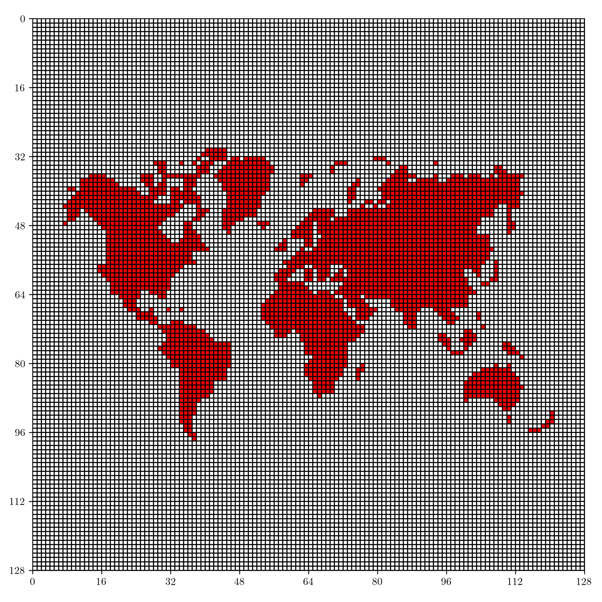
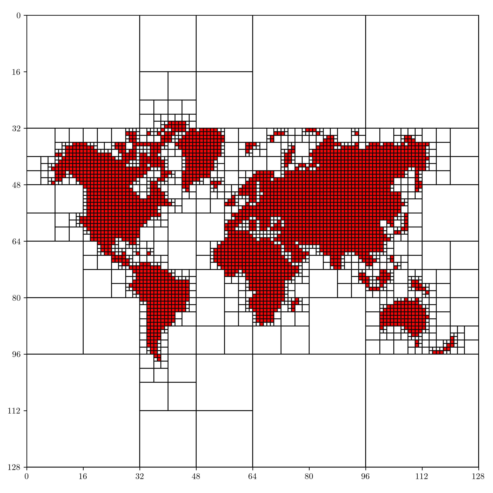
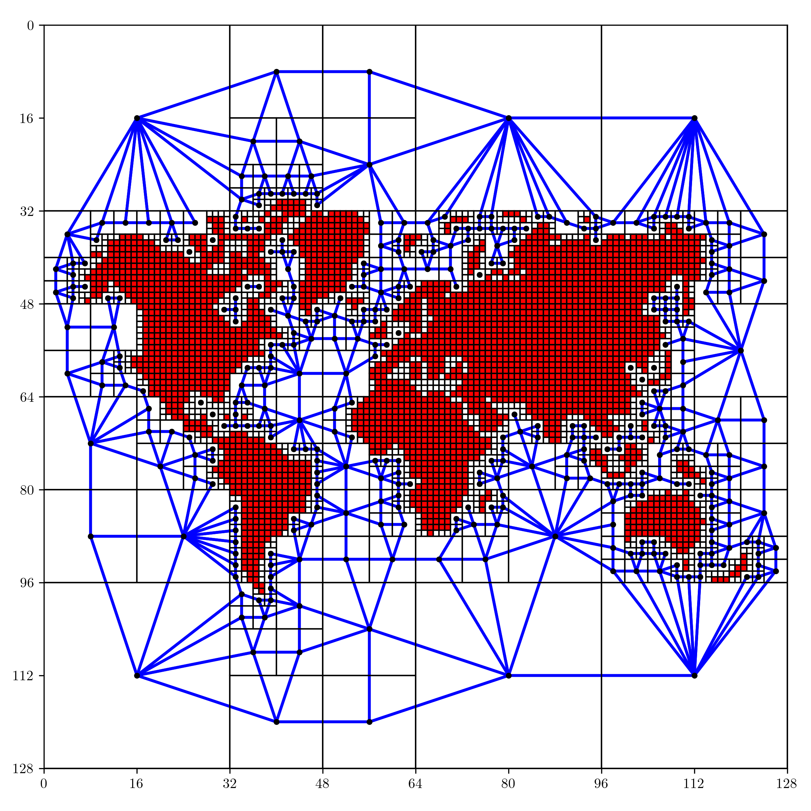
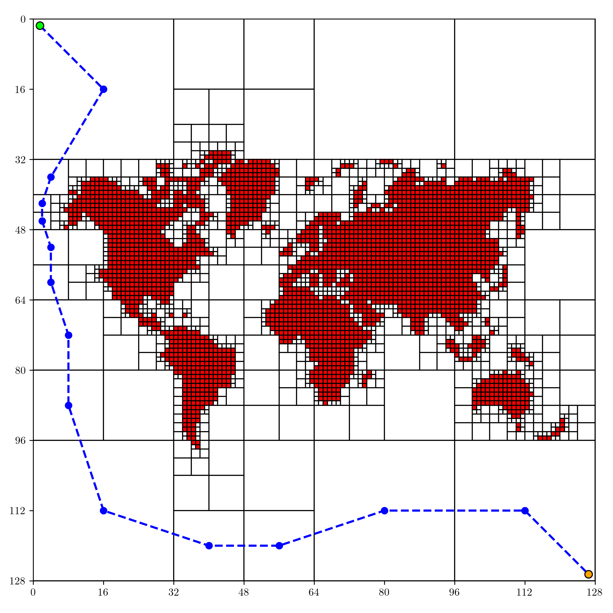
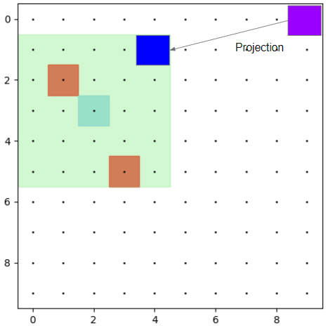
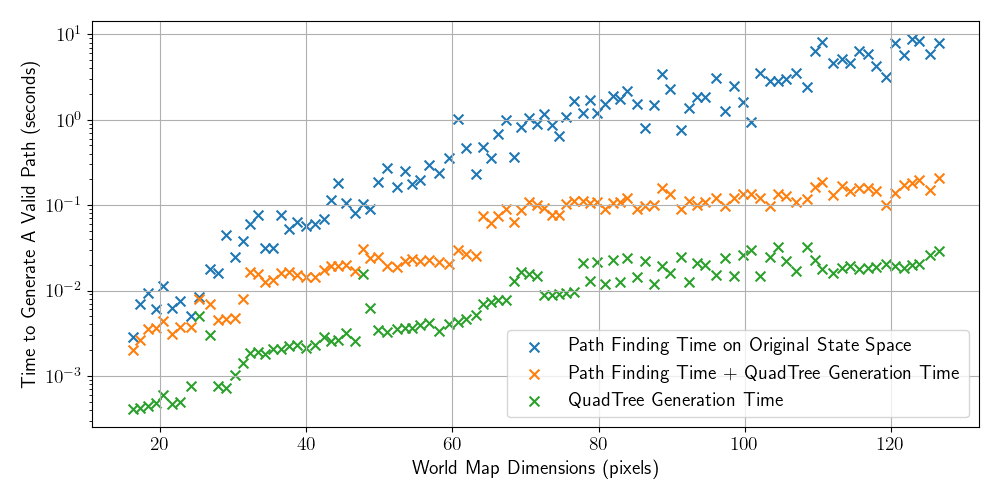

# Single-Agent Path Planning within Dynamical Environments with Large-Scale Obstacles

- Yskandar Gas
- Hayato Kato
- David Kao

# Problem Formulation : What are we trying to solve ?
A consequent part of the material presented in class until now can be thought of as part of the broader task of path planning. We have addressed the problem of planning the path of an agent in a discrete environment as well as a continuous environment, featuring obstacles. Many ways of solving this problem were introduced, each of them tailored to match specific requirements imposed by specific constraints. The problem we propose to address in this project is the one of **Path Planning in a dynamic environment**. Indeed, the algorithms that were introduced in this class make the assumption that the obstacles (or the goal) in the environment are fixed. However, it is rather obvious that such conditions are rarely met. Thus, we propose to relax that assumption.

# General assumptions
We are provided with a discrete space, discrete time environment in which we are controlling a robot. The task we are trying to solve is to generate a path from the original position to the fixed goal of the robot **without causing any collision** with the obstacles. We make the following assumptions:
- The environment is in discrete space (gridworld-like)
- Our robot is holonomic, and its dynamics are deterministic.
- We know the initial position of the robot.
- We know the position of the goal in the environment.
- Our robot is represented as a point mass in the environment.
- We know the number of obstacles in the environment, as well as their initial positions.
- We assume we have access to the position of the robot at any time.
- We assume that our robot is provided with a sensor that allows it to observe its surroundings, which we represent by a grid of 5 by 5 operational states centered on the robot (occupancy grid).

# Mathematical Formulation
State Space : $\mathcal{S} = \set{(x,y)|x,y \in \mathbb{N}, 0 \le x \le Xdim, 0 \le y \le Ydim} $, $Xdim, Ydim \in \mathbb{N}$, $S \subset \mathbb{N}^2$

Action Space : $\mathcal{A} = \set{\text{(0,1), (0,-1), (-1,0), (1,0), (0,0)}}$,  $A \subset \mathbb{Z}^2$

Observation Space : $\mathcal{G} = [[0, 1]]^{5\times5}$

Fixed Obstacle Space : $\mathcal{O} \subset \mathcal{S}$

Let $f : \mathcal{S} \times \mathcal{A} \rightarrow \mathcal{S}$ be the function describing the dynamics of our robot.

Let $N \in \mathbb{N}$ be the number of iterations : Moving Obstacle Space at iteration $i \in [[0, n-1]]$ : $\mathcal{M_i} \subset \mathcal{S}$

Task : Compute a sequence of states (trajectory) $\mathcal{T} = \set{S_0, S_1, ..., S_{N-1}}$ with $S_0$ the initial state of the robot and $S_{N-1}$ the goal state, such that $\forall$ i $\in [[0, N-2]]$, $\exists a \in \mathcal{A} \text{ such that } f(S_i, a) = S_{i+1} \text{ and } S_i \notin M_i.$

# Our approach

We divide the global problem into two subproblems : global and local path-planning.
Global path-planning refers to the task of computing a path from the initial position of the robot to the goal state that avoids the large fixed obstacles.
Local path-planning refers to the task of computing a local path from one position of the global path to the next one, while avoiding the moving obstacles.

- To solve the global path-planning problem efficiently, **we use a QuadTree representation of the map** (see figure below). This allows us to reduce the number of states on which to perform the path search. 

<figure>

<figcaption align = "center"><b>Left : Original State Space, Right : Decomposed State Space</b></figcaption>

  
</figure>

- Once the Quadtree representation is built, we use Breadth First Search to find the shortest path from the current position to the goal state.

<figure>

<figcaption align = "center"><b>Left : Directed Graph (depth = 1), Right : Global Path using BFS</b></figcaption>

 
</figure>

The global path obtained using the QuadTree decomposition method allows for the avoidance of the large fixed obstacles and provides us with a general path to follow. 
For the local path-planning problem, we rely on the robot’s sensor, which gives us information about the robot’s surroundings **under the form of an occupancy grid centered on the robot**. Our approach consists in building an intermediate environment from the current sensor measurement, projecting the next state in the global QuadTree path to the intermediate environment and solving the intermediate path planning problem using a graph search based method. See the figure below for an overview of the local environment.

<figure>

  
<figcaption align = "center"><b>Overview of the local environment</b></figcaption>

</figure>

In this environment, we know the current position of the moving obstacles. However, we still do not know their dynamics and thus their position at the next time step. Thus, when we plan our path, we omit the states occupied by the moving obstacles **as well as the states adjacent to them**, to prevent any collisions.

# Results : Efficient and Safe

Here's an example of our solution running. The green square represents the robot's observation area. The red squares represent the fixed and moving obstacles. The blue squares represent the global path to follow.
<figure>

  
<figcaption align = "center"><b>Example of application</b></figcaption>

</figure>

If we let the simulqtion run completely, we can observe the resulting trajectory of the robot.
<figure>

  
  
<figcaption align = "center"><b>Example of application</b></figcaption>

</figure>

After testing our system on different maps and gathering some data, we show that we avoid any potential collisions, and **for big enough maps we divide the computation time by 10** compared to a Graph search method on the original state space (without Quadtree representation), as shown on the figure below.

<figure>

  
<figcaption align = "center"><b>Feasible Path Computation Time Across Different Map Dimensions</b></figcaption>

</figure>

# Conclusion
- We demonstrate that our method has significant computational savings on environments that have high amounts of empty space, making it a suitable method in environments with few obstacles or large chunks of empty space in between static obstacles. This is due in part to the reduction of search space that is created using the quadtree decomposition.
- Our paper focused on a discrete space environment. However, to apply our findings to real-world applications, we need to extend our method to consider continuous space.
This includes removing the holonomic assumption, as well as introducing boundaries on the physical limits of the agent, e.g. velocity, centrifugal force, and turn radius.
- We have not conducted an in-depth study regarding the best graph-search algorithm to use for the global and local path-planning, from which we could draw interesting results.
- It would be interesting to implement a Kalman filter to try and estimate the dynamics of the moving obstacles, to try and improve the local-path planning part, which remains very conservative for now since all the states adjacent to obstacles are forbidden.

# References
1. Kant, Kamal, and Steven W. Zucker. "Toward efficient trajectory planning: The path-velocity decomposition." The international journal of robotics research 5.3 (1986): 72-89.
2. Erdmann, Michael, and Tomas Lozano-Perez. "On multiple moving objects." Algorithmica 2.1 (1987): 477-521.
3. Ganeshmurthy, M. S., and G. R. Suresh. "Path planning algorithm for autonomous mobile robot in dynamic environment." 2015 3rd International Conference on Signal Processing, Communication and Networking (ICSCN). IEEE, 2015.
4. Fujimura, Kikuo, and Hanan Samet. "A hierarchical strategy for path planning among moving obstacles (mobile robot)." IEEE transactions on robotics and Automation 5.1 (1989): 61-69.
5. Fraichard, Thierry, and Christian Laugier. "Dynamic trajectory planning, path-velocity decomposition and adjacent paths." IJCAI. 1993.
6. Phillips, Mike, and Maxim Likhachev. "Sipp: Safe interval path planning for dynamic environments." 2011 IEEE International Conference on Robotics and Automation. IEEE, 2011.
7. Zhong, Xunyu, et al. "Hybrid path planning based on safe A* algorithm and adaptive window approach for mobile robot in large-scale dynamic environment." Journal of Intelligent & Robotic Systems 99.1 (2020): 65-77.

